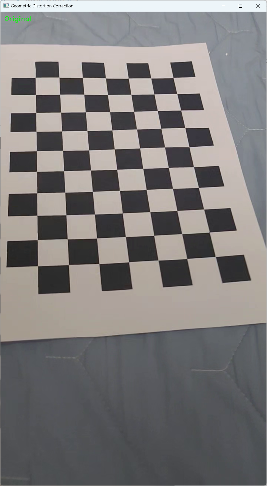
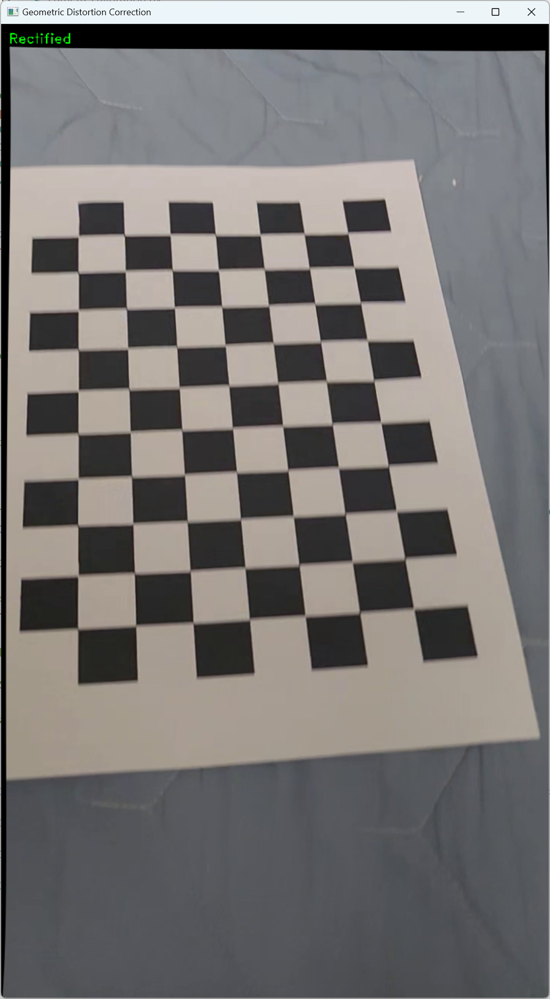

# Camera_Distort_Corrector
카메라 왜곡 보정 예제

# 개요
카메라의 Calibration을 수행하고, 그 결과를 이용하여 distortion을 정정하는 예제입니다.
data 폴더의 `ChessBoard.mp4` 파일을 기준으로 합니다.

# 카메라 Calibration 결과
## Camera Calibration Results
* The number of selected images = 20
* RMS error = 0.9895495508143434
* Camera matrix (K) =
[[1.18808292e+03 0.00000000e+00 3.51696936e+02]
 [0.00000000e+00 1.18650185e+03 6.24902687e+02]
 [0.00000000e+00 0.00000000e+00 1.00000000e+00]]
* Distortion coefficient (k1, k2, p1, p2, k3, ...) = [ 0.02205492  0.47085272 -0.01021119  0.00712299 -1.24242936]

# 카메라 왜곡 보정 결과
## 원본

## 보정 이후

# 코드 출처
## camera_calibration.py
https://github.com/mint-lab/3dv_tutorial/blob/master/examples/camera_calibration.py
## distortion_correction.py
https://github.com/mint-lab/3dv_tutorial/blob/master/examples/distortion_correction.py
